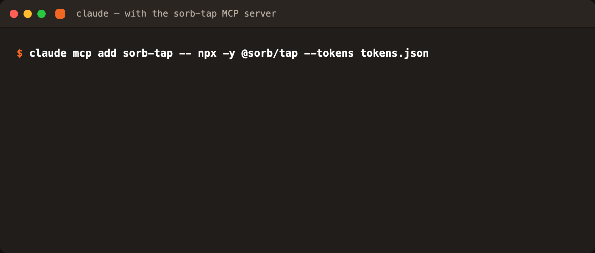

<p align="center">
  
</p>

# @sorb/tap

**Give your AI agent read access to your design system.** `@sorb/tap` is an
MCP ([Model Context Protocol](https://modelcontextprotocol.io)) server for
design tokens: point it at a
[DTCG](https://design-tokens.github.io/community-group/format/) token file, a
[Sorb™](https://www.sorbcloud.com) project, or a running Sorb bridge, and your
agent can answer questions like *"where does this button color come from?"* —
with the actual alias chain and the components that use it. Read-only by design.

## Quickstart

```sh
# Claude Code — try it against the bundled example set:
claude mcp add sorb-tap -- npx -y @sorb/tap --tokens node_modules/@sorb/tap/examples/acme-tokens.json

# …or your own DTCG file(s):
claude mcp add sorb-tap -- npx -y @sorb/tap --tokens tokens.json
```

Then ask: *"What's the button background token, and where does it come from?"*



**Other MCP clients** (Cursor, LangChain, anything that speaks MCP over
stdio): register the same command — `npx -y @sorb/tap --tokens tokens.json` —
as a stdio server, using your client's own config format.

## What the agent sees

Real output against `examples/acme-tokens.json`:

```
▸ resolve_token { "id": "component.button.bg" }
{
  "id": "component.button.bg",
  "cssVar": "--component-button-bg",
  "value": "#3b82f6",
  "chain": ["semantic.brand.primary", "primitive.blue.500"]
}

▸ list_tokens { "tier": "semantic" }
{
  "count": 4,
  "tokens": [
    { "id": "semantic.brand.primary", "cssVar": "--semantic-brand-primary",
      "value": "#3b82f6", "tier": "semantic", "type": "color" },
    …
  ]
}
```

## Tools

Six tools, all read-only. Token ids are dot paths (`component.button.bg`);
everywhere an `id` is accepted, the CSS variable form (`--component-button-bg`)
works too.

| tool | what it returns |
|---|---|
| `list_tokens(tier?, type?, q?)` | tokens with id, CSS variable, resolved value, tier, type — filter by tier (`primitive`/`semantic`/`component`), `$type`, or substring |
| `get_token(id)` | one token, raw authored value + resolved |
| `resolve_token(id)` | final value with the alias chain that produced it |
| `list_components()` | captured components/stories |
| `get_component_bindings(component)` | role → token map (`fill`/`stroke`/`cornerRadius`/…) |
| `find_token_usage(id)` | reverse index: which components bind a token, and in which roles |

Plus one resource, `sorb-tap://tokens` — the full resolved token map as JSON.

The three component tools need Sorb capture artifacts (`sorb-seed capture`) or
a bridge; in bare-DTCG mode they say so instead of returning silent emptiness,
so the agent knows what would unlock them.

## Sources

| flag | serves |
|---|---|
| `--tokens <file.json> …` | bare DTCG token file(s) — **no Sorb required** |
| `--dir <project>` | a Sorb project: `.sorb/resolved.json` + capture artifacts |
| `--bridge <url> [--pk <key>]` | a running Sorb bridge (`sorb dev`); hosted bridges — e.g. `bridge.sorbcloud.com` — work with a read-only `sorb_pk_` key from your workspace |

No flags: auto-detects `.sorb/` in the cwd, else `tokens/*.json`.
Env: `SORB_TAP_BRIDGE` (bridge URL), `SORB_TAP_PK` (read-only key).

## LangChain

A runnable example agent lives in
[`examples/langchain-client`](examples/langchain-client) — the same six tools
loaded through `@langchain/mcp-adapters` into a LangChain (LangGraph) agent.

## Limitations

- **Read-only.** No tool writes, proposes, or applies changes — by design.
- The DTCG reader resolves `$value`/`$type`/`{alias}` references only: no
  Style Dictionary transforms, no math expressions, no modes/theming. For
  those, run the file through your build and point tap at the output — or at a
  Sorb project, where `.sorb/resolved.json` is the built map.
- Bridge mode snapshots at startup; restart (or call `refresh()` when
  embedding) to pick up new captures.
- Component bindings come from Sorb captures — bare DTCG files have none.

## Programmatic use

```js
import { loadDtcgFiles, runTool } from '@sorb/tap'
const source = loadDtcgFiles(['tokens.json'])
runTool(source, 'resolve_token', { id: 'component.button.bg' })
// → { id, cssVar, value: '#3b82f6', chain: ['semantic.brand.primary', …] }
```

## Development

```sh
npm install && npm test    # node:test, 17 cases, incl. a stub bridge
npm run build              # esbuild → dist/ (JS only — no TypeScript, ever)
```

Roadmap: authenticated write tools (propose/apply) may arrive later via Sorb
Cloud; the read surface here stays free and open.

---

Part of the Sorb tree — **Seed** captures · **Juice** bridges · **Leaf**
renders · **Canopy** designs · **Tap** is how agents draw from it.

MIT © Metatoy LLC · Sorb™ is a trademark of Metatoy LLC.
Works with Figma. Not affiliated with, or endorsed by, Figma. Figma is a
trademark of Figma, Inc.
